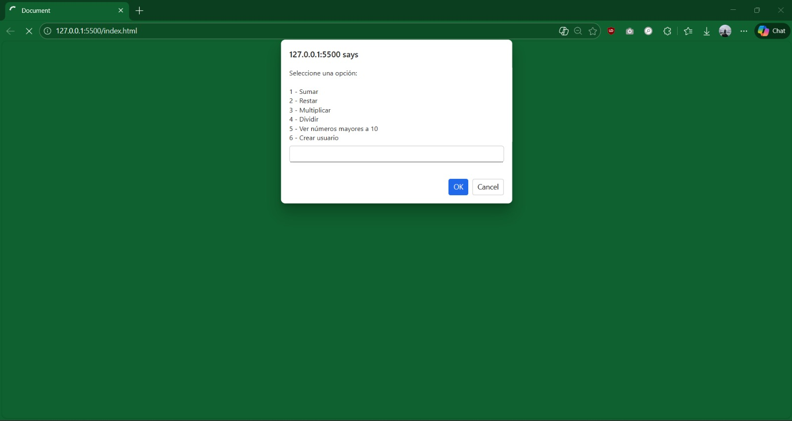

# 📘 Aplicación de Consola en JavaScript

## 📌 Nombre del proyecto
Aplicación de Consola – Fundamentos de Programación en JavaScript

---

## 🎯 Objetivo del proyecto

Desarrollar una aplicación en consola que permita aplicar los fundamentos básicos de JavaScript, incluyendo funciones, estructuras condicionales, ciclos, arreglos y objetos. El proyecto tiene como finalidad reforzar la lógica de programación y la organización del código mediante la separación de tareas en funciones reutilizables.

---

## 📝 Descripción

Esta aplicación permite al usuario interactuar desde la consola del navegador para realizar distintas acciones:

- Operaciones matemáticas básicas que se realizan con funciones independientes.
- Recorrido de un arreglo utilizando un ciclo for para identificar números mayores a un límite establecido.
- Creación de un objeto usuario con un método `presentarse` que incluye el correo provisto por el usuario.

El programa organiza el código en funciones claras para facilitar su lectura y comprensión.

---

## ⚙️ Funcionalidades

- Suma de dos números.
- Resta de dos números.
- Multiplicación de dos números.
- División con validación para evitar dividir por cero.
- Mostrar números mayores a 10 desde un arreglo.
- Crear un usuario con nombre, edad y correo electrónico.
- Mostrar un mensaje de presentación usando un método dentro de un objeto.

---

## 🧠 Conceptos aplicados

- Declaración y uso de funciones.
- Organización del código en funciones específicas para cada tarea.
- Uso de estructuras condicionales (`if / else`, `switch`) para manejar las opciones del menú.
- Ciclo `for` para recorrer el arreglo y construir la lista filtrada.
- Manipulación de arreglos utilizando (`push`).
- Validación de datos ingresados por el usuario con `prompt` + `Number.isFinite`.

---

## 🔎 Validaciones implementadas

- Se valida que no se pueda dividir por cero; en ese caso se muestra un mensaje en consola.
- Se controla que la opción ingresada en el menú sea válida y se rechazan entradas fuera del rango.
- Se controlan entradas inválidas o cancelaciones en los prompt.
- Se valida que los datos del usuario no estén incompletos antes de crear el objeto.

---

## 🛠️ Tecnologías utilizadas

- JavaScript
- Visual Studio Code
- Navegador Web

---

## 📥 Instalación

1. Descargar o clonar el repositorio.
2. Abrir la carpeta del proyecto en Visual Studio Code.
3. Verificar que el archivo JavaScript esté vinculado correctamente en el HTML:

   ``

4. Abrir el archivo `index.html` en el navegador.

---

## ▶️ Uso

1. Abrir el archivo `index.html` en el navegador.
2. Presionar **F12** y seleccionar la pestaña **Consola**.
3. Se mostrará un menú con las opciones disponibles.
4. Ingresar el número correspondiente a la acción deseada.
5. Seguir las instrucciones ingresando los datos solicitados (nombre, edad, correo, según corresponda).
6. Los resultados se mostrarán en la consola.

---

## 📸 Capturas de pantalla

A continuación se presentan evidencias del funcionamiento de la aplicación.
Las capturas incluyen imágenes y archivos GIF, los cuales permiten visualizar de manera más clara el comportamiento del programa, las validaciones y la interacción con el usuario en la consola.

### Menú principal

### Operación matemática

### Creación de usuario

### Error

---

## 📂 Estructura del proyecto

📁 PROYECTO MODULO 4 - JAVASCRIPT
│── 📁 screenshots
│   ├── error.gif
│   ├── errordivision.gif
│   ├── menu.jpeg
│   └── usuario.gif
│── index.html
│── README.md
│── script.js

---

## 🔍 Análisis del proyecto

Durante el desarrollo del proyecto se aplicaron los fundamentos básicos de JavaScript trabajados en el módulo. Se estructuró el programa utilizando funciones separadas para cada operación, lo que facilita su lectura y organización.

El uso de arreglos permitió practicar el recorrido de datos mediante un ciclo for, mientras que la creación de un objeto ayudó a comprender cómo agrupar información y comportamientos en una sola estructura.

Además, se implementaron validaciones básicas para evitar errores comunes, como la división por cero o entradas inválidas en `prompt`.

---

## 🧠 Reflexión final

Este proyecto permitió reforzar la lógica de programación y comprender la importancia de modularizar el código. También ayudó a entender cómo interactuar con el usuario mediante la consola y cómo organizar datos utilizando arreglos y objetos.

La práctica permitió aplicar de manera concreta los conceptos vistos en clase y mejorar la comprensión del lenguaje JavaScript.

---

